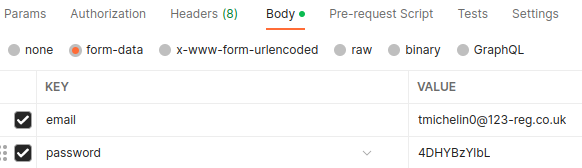
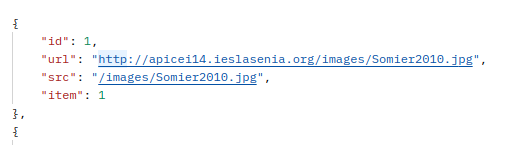

# Furnipop API Documentation

Furnipop is an API project designed for Mudanzas Sevilla's database built in django scripted by Miguel Jimenez and Cesar Frutos.

## Table of Contents
1. [Usage](#api-usage)
2. [Endpoints](#endpoints)
   1. [Camion](#camiones)
   2. [Colores](#colores)
   3. [Clientes](#clientes)
   4. [Contenedores](#contenedores)
   5. [Departamentos](#departamentos)
   6. [Direcciones](#direcciones)
   7. [Empleados](#empleados)
   8. [Estado Item](#estado-items)
   9. [Estado Pedido](#estado-pedidos)
   10. [Favoritos](#favoritos)
   11. [Imagen](#imagenes)
   12. [Item](#items)
   13. [Item in Lote](#items-in-lote)
   14. [Lote](#lotes)
   15. [Material](#materiales)
   16. [Metodos Pago](#metodos-pago)
   17. [Paypal](#paypal)
   18. [Pedido](#pedidos)
   19. [[*] Item in Pedido](#items-in-pedido)
   20. [[*] Lote in Pedido](#lotes-in-pedido)
3.  [Special Endpoints](#special-endpoints)
    1.  [Login Cliente](#login-cliente)
    2.  [Login Empleado](#login-empleado)
___

## API Usage
Any request must be done to this address: **apicei14.ieslasenia.org/**\
All endpoints return an HTTP response, and information is given in a json format.\

Every endpoint in this project is splitted in four different HTTP methods:
- GET : Used to ask for information to the API.
- POST : Used to upload information to the API.
- PUT : Used to update information from the API.
- DELETE: Used to delete information from the API.

### **Important** 
To make a request to any endpoint that requires an ID, for instance: 
- **/cliente?pk=1**

As seen, we must declare that ID as a query string param.
A multiple ID request would look like this:
- **/lote/item?lote_pk=1&item_pk=2**
> Every endpoint in this documentation shows how to make a proper request for any kind of information available.

Lastly, POST or PUT methods requere information to be sent, that information must be filled in the <ins> **body**</ins> of the request as <ins> **form-data** </ins> in a key/value format.

[Go to top](#table-of-contents)
____

## Endpoints
Almost every endpoint has the following structure:
- [GET] All ➜ Returns every object of a kind.
- [GET] One ➜ Returns an object of a kind, filtered by its ID.
- [POST] Works as explained [here](#table-of-contents).
- [PUT] Works as explained [here](#table-of-contents).
- [DELETE] Works as explained [here](#table-of-contents).

> Note: Not every field key/value in a PUT request is mandatory to fulfill. You can just send the amount of fields you need at a time.
> 
[Go to top](#table-of-contents)
___
## Camiones

### [GET] All Camiones
Returns every camion in the database.
> apicei14.ieslasenia.org/camiones

### [GET] Camion
Returns a camion from the database.\
**Required params:**
-  pk : ID of a camion.
> apicei14.ieslasenia.org/camion

### [POST] Camion
Uploads a camion to the database. Returns this camion.\
**Required body form-data:**
- matricula: Self-desciptive.
> apicei14.ieslasenia.org/camiones

### [PUT] Camion
Updates a camion from the database. Returns this camion.\
**Required params:**
- pk : ID of a camion.

**Required body form-data:**
- nombre : Self-descriptive.
> apicei14.ieslasenia.org/camion

### [DELETE] Camion
Deletes a camion from the database. Returns this camion.\
**Required params:**
-  pk : ID of a camion.
> apicei14.ieslasenia.org/camion

[Go to top](#table-of-contents)
___
## Clientes

### [GET] All clientes
Returns every cliente in the database.
> apicei14.ieslasenia.org/clientes

### [GET] Cliente
Returns a cliente from the database.\
**Required params:**
-  pk : ID of a cliente.
> apicei14.ieslasenia.org/cliente

### [POST] Cliente
Uploads a cliente to the database. Returns this cliente.\
**Required body form-data:**
- nombre : Name of a cliente.
- apellidos : Apellidos (both) of a cliente.
- dni : DNI of a cliente.
- fecha_nacimiento : Birthdate of a cliente. (yyyy-MM-dd)
- email : Email of a cliente.
- password : Password of a cliente account.
> apicei14.ieslasenia.org/clientes

### [PUT] Cliente
Updates a cliente from the database. Returns this cliente.\
**Required params:**
- pk : ID of a cliente.

**Required body form-data:**
- nombre : Name of a cliente.
- apellidos : Apellidos (both) of a cliente.
- dni : DNI of a cliente.
- fecha_nacimiento : Birthdate of a cliente. (yyyy-MM-dd)
- email : Email of a cliente.
- password : Password of a cliente account.
> apicei14.ieslasenia.org/cliente

### [DELETE] Cliente
Deletes a cliente from the database. Returns this cliente.\
**Required params:**
-  pk : ID of a cliente.
> apicei14.ieslasenia.org/cliente

[Go to top](#table-of-contents)
___
## Colores

### [GET] All Colores
Returns every color in the database.
> apicei14.ieslasenia.org/colores

### [GET] Color
Returns a color from the database.\
**Required params:**
-  pk : ID of a color.
> apicei14.ieslasenia.org/color

### [POST] Color
Uploads a color to the database. Returns this color.\
**Required body form-data:**
- nombre : Name of a color.
> apicei14.ieslasenia.org/colores

### [PUT] Color
Updates a color from the database. Returns this color.\
**Required params:**
- pk : ID of a color.

**Required body form-data:**
- nombre : Name of a color.
> apicei14.ieslasenia.org/color

### [DELETE] Color
Deletes a color from the database. Returns this color.\
**Required params:**
-  pk : ID of a color.
> apicei14.ieslasenia.org/color

[Go to top](#table-of-contents)
___
## Contenedores

### [GET] All Contenedores
Returns every contenedor in the database.
> apicei14.ieslasenia.org/contenedores

### [GET] Contenedor
Returns a contenedor from the database.\
**Required params:**
-  pk : ID of a contenedor.
> apicei14.ieslasenia.org/contenedor

### [POST] Contenedor
Uploads a contenedor to the database. Returns this contenedor.\
**Required body form-data:**
- referencia : Reference code of a contenedor. (AAAA)
- fecha_alta : Submit date for a contenedor. (yyyy-MM-dd)
> apicei14.ieslasenia.org/contenedores

### [PUT] Contenedor
Updates a contenedor from the database. Returns this contenedor.\
**Required params:**
- pk : ID of a contenedor.

**Required body form-data:**
- referencia : Reference code of a contenedor. (AAAA)
- fecha_alta : Submit date for a contenedor. (yyyy-MM-dd)
  
> apicei14.ieslasenia.org/contenedor

### [DELETE] Contenedor
Deletes a contenedor from the database. Returns this contenedor.\
**Required params:**
-  pk : ID of a contenedor.
> apicei14.ieslasenia.org/contenedor

[Go to top](#table-of-contents)
___
## Departamentos

### [GET] All Departamentos
Returns every departamento in the database.
> apicei14.ieslasenia.org/departamentos

### [GET] Departamento
Returns a departamento from the database.\
**Required params:**
-  pk : ID of a departamento.
> apicei14.ieslasenia.org/departamento

### [POST] Departamento
Uploads a departamento to the database. Returns this departamento.\
**Required body form-data:**
- nombre : Name of a departamento.
- codigo : Code of a department. (AA)
> apicei14.ieslasenia.org/departamentos

### [PUT] Departamento
Updates a departamento from the database. Returns this departamento.\
**Required params:**
- pk : ID of a departamento.

**Required body form-data:**
- nombre : Name of a departamento.
- codigo : Code of a department. (AA)
  
> apicei14.ieslasenia.org/departamento

### [DELETE] Departamento
Deletes a departamento from the database. Returns this departamento.\
**Required params:**
-  pk : ID of a departamento.
> apicei14.ieslasenia.org/departamento

[Go to top](#table-of-contents)
___
## Direcciones

### [GET] All Direcciones
Returns every color in the database.
> apicei14.ieslasenia.org/direcciones

### [GET] Direccion
Returns a direccion from the database.\
**Required params:**
-  pk : ID of a direccion.
> apicei14.ieslasenia.org/direccion

### [POST] Direccion
Uploads a direccion to the database. Returns this direccion.\
**Required body form-data:**
- linea1 : Main address.
- linea2 : Alternative address.
- codigo_postal : ZIP Code.
- ciudad : City of a direccion.
- provincia : State of a direccion.
- cliente : Client owner of a direccion.
> apicei14.ieslasenia.org/direcciones

### [PUT] Direccion
Updates a direccion from the database. Returns this direccion.\
**Required params:**
- pk : ID of a direccion.

**Required body form-data:**
- nombre : Name of a direccion.
> apicei14.ieslasenia.org/direccion

### [DELETE] Direccion
Deletes a direccion from the database. Returns this direccion.\
**Required params:**
-  pk : ID of a direccion.
> apicei14.ieslasenia.org/direccion

[Go to top](#table-of-contents)

___
## Empleados

### [GET] All Empleados
Returns every depertmento in the database.
> apicei14.ieslasenia.org/empleados

### [GET] Empleado
Returns an empleado from the database.\
**Required params:**
-  pk : ID of an empleado.
> apicei14.ieslasenia.org/empleado

### [POST] Empleado
Uploads an empleado to the database. Returns this empleado.\
**Required body form-data:**
- nombre : Name of an empleado.
- apellidos Apellidos (both) of an empleado.
- email : Email of an empleado.
- password : Password of an empleado account.
- nss : NSS of an empleado.
- dni : DNI of an empleado.
- departamento : Departamento ID of an empleado.
> apicei14.ieslasenia.org/empleados

### [PUT] Empleado
Updates an empleado from the database. Returns this empleado.\
**Required params:**
- pk : ID of an empleado.

**Required body form-data:**
- nombre : Name of an empleado.
- apellidos Apellidos (both) of an empleado.
- email : Email of an empleado.
- password : Password of an empleado account.
- nss : NSS of an empleado.
- dni : DNI of an empleado.
- departamento : Departamento ID of an empleado.
  
> apicei14.ieslasenia.org/empleado

### [DELETE] Empleado
Deletes an empleado from the database. Returns this empleado.\
**Required params:**
-  pk : ID of an empleado.
> apicei14.ieslasenia.org/empleado

### [GET] All Empleados from Departamento
Returns every empleado from a departamento.
**Required params:**
- pk : ID of a departamento
> apicei14.ieslasenia.org/departamento/empleados

### [PUT] Empleado into Departamento
Inserts an empleado into a departamento. Returns this empleado.\
**Required params:**
- empleado_pk : ID of an empleado.
- departamento_pk : ID of a departamento.
  
> apicei14.ieslasenia.org/departamento/empleado

[Go to top](#table-of-contents)
___
## Favoritos

### [GET] All Favoritos
Returns every favorito of a cliente in the database.\
**Required params:**
-  pk : ID of a Cliente.
> apicei14.ieslasenia.org/cliente-favoritos

### [GET] Favorito
Returns an item from a cliente favorite's list.\
**Required params:**
-  cliente_pk : ID of a Cliente.
-  item_pk : ID of a Item in Cliente's favorite list.
> apicei14.ieslasenia.org/cliente-favorito

### [PUT] Favorito
Adds an item to a cliente favorite's list.\
**Required params:**
-  cliente_pk : ID of a Cliente.
-  item_pk : ID of a Item in Cliente's favorite list.
> apicei14.ieslasenia.org/cliente-favorito

### [DELETE] Favorito
Removes an item from a cliente favorite's list.\
**Required params:**
-  cliente_pk : ID of a Cliente.
-  item_pk : ID of a Item in Cliente's favorite list.
> apicei14.ieslasenia.org/cliente-favorito

[Go to top](#table-of-contents)
___

## Estado Items

### [GET] All Estados Items
Returns every estado of an item in the database.
> apicei14.ieslasenia.org/estados-items

### [GET] Estado Item
Returns an estado of an item from the database.\
**Required params:**
-  pk : ID of an estado.
> apicei14.ieslasenia.org/estado-item

### [POST] Estado Item
Uploads an estado of an item to the database. Returns this estado.\
**Required body form-data:**
- nombre : State.
> apicei14.ieslasenia.org/estados-items

### [PUT] Estado Item
Updates an estado of an item from the database. Returns this estado.\
**Required params:**
- pk : ID of an estado.

**Required body form-data:**
- nombre : State.
> apicei14.ieslasenia.org/estado-item

### [DELETE] Estado Item
Deletes an estado of an itemfrom the database. Returns this estado.\
**Required params:**
-  pk : ID of an estado.
> apicei14.ieslasenia.org/estado-item

[Go to top](#table-of-contents)
___

## Estado Pedidos

### [GET] All Estados Pedidos
Returns every estado of an pedido in the database.
> apicei14.ieslasenia.org/estados-pedidos

### [GET] Estado Pedidos
Returns an estado of an pedido from the database.\
**Required params:**
-  pk : ID of an estado.
> apicei14.ieslasenia.org/estado-pedido

### [POST] Estado Pedidos
Uploads an estado of an pedido to the database. Returns this estado.\
**Required body form-data:**
- nombre : State.
> apicei14.ieslasenia.org/estados-pedidos

### [PUT] Estado Pedidos
Updates an estado of an pedido from the database. Returns this estado.\
**Required params:**
- pk : ID of an estado.

**Required body form-data:**
- nombre : State.
> apicei14.ieslasenia.org/estado-pedido

### [DELETE] Estado Pedidos
Deletes an estado of an pedidofrom the database. Returns this estado.\
**Required params:**
-  pk : ID of an estado.
> apicei14.ieslasenia.org/estado-pedido

[Go to top](#table-of-contents)
___

## Imagenes

An Image object looks like this. It cointains an URL which can be accessed and returns the image as file.

### [GET] All Imagenes
Returns every imagen in the database.
> apicei14.ieslasenia.org/imagenes

### [GET] Imagen
Returns an image item from the database.\
**Required params:**
-  pk : ID of an imagen.
> apicei14.ieslasenia.org/imagen

### [POST] Imagen
Uploads an image to the database. Returns this image.\
**Required headers:**
- Content-Type : multipart/form-data

**Required body form-data:**
- src : Image file.
- item : ID of an item bounded to this image.
> apicei14.ieslasenia.org/imagenes

### [PUT] Imagen
Updates an image from the database. Returns this image.\
**Required params:**
- pk : ID of an image.

**Required headers:**
- Content-Type : multipart/form-data

**Required body form-data:**
- src : Image file.
- item : ID of an item bounded to this image.
> apicei14.ieslasenia.org/imagen

### [DELETE] Imagen
Deletes an imagen from the database. Returns this imagen.\
**Required params:**
-  pk : ID of an imagen.
> apicei14.ieslasenia.org/imagen

[Go to top](#table-of-contents)

___

## Items

### [GET] All Items
Returns every item in the database.
> apicei14.ieslasenia.org/items

### [GET] Item
Returns an item from the database.\
**Required params:**
-  pk : ID of an item.
> apicei14.ieslasenia.org/item

### [POST] Item
Uploads an item to the database. Returns this item.\
**Required body form-data:**
- titulo : Title of an item.
- descripcion : Its description.
- fecha alta: Submit date of an item. (yyyy-MM-dd)
- alto : Height.
- ancho : Weight.
- preferencias : Preferences of an item.
- cantidad : Qty.
- contenedor : Contenedor that cointains an item.
- material : Material which an item was made.
- estado_item : The state of an item.
- empleado : Responsible Empleado of an item.
> apicei14.ieslasenia.org/items

### [PUT] Item
Updates an item from the database. Returns this item.\
**Required params:**
- pk : ID of an item.

**Required body form-data:**
- titulo : Title of an item.
- descripcion : Its description.
- fecha alta: Submit date of an item. (yyyy-MM-dd)
- alto : Height.
- ancho : Weight.
- preferencias : Preferences of an item.
- cantidad : Qty.
- contenedor : Contenedor that cointains an item.
- material : Material which an item was made.
- estado_item : The state of an item.
- empleado : Responsible Empleado of an item.
> apicei14.ieslasenia.org/item

### [DELETE] Item
Deletes an item from the database. Returns this item.\
**Required params:**
-  pk : ID of an item.
> apicei14.ieslasenia.org/item

[Go to top](#table-of-contents)
___

## Items In Lote

### [GET] All Items from Lote
Returns every item from a lote item in the database.
**Required params:**
- pk : ID of a Lote.
> apicei14.ieslasenia.org/lote/items

### [GET] Item from Lote
Returns an item from a lote in the database.\
**Required params:**
- lote_pk : ID of a lote.
- item_pk : ID of an item.
> apicei14.ieslasenia.org/lote/item

### [PUT] Item from Lote
Bounds an item to a lote in the database. Returns this item.\
**Required params:**
- lote_pk : ID of a lote.
- item_pk : ID of an item.
  
**Required body form-data:**
- cantidad: Quantity of an item in a lote.
> apicei14.ieslasenia.org/lote/item

### [DELETE] Item from Lote
Removes an item from a lote in the database. Returns this item.\
**Required params:**
- lote_pk : ID of a lote.
- item_pk : ID of an item.
> apicei14.ieslasenia.org/lote/item

[Go to top](#table-of-contents)
___
## Lotes

### [GET] All Lotes
Returns every lote in the database.
> apicei14.ieslasenia.org/lotes

### [GET] Lote
Returns a lote from the database.\
**Required params:**
-  pk : ID of a lote.
> apicei14.ieslasenia.org/lote

### [POST] Lote
Uploads a lote to the database. Returns this lote.\
**Required body form-data:**
- nombre : Name of a lote.
- empelado : Responsible Empleado of a lote.
> apicei14.ieslasenia.org/lotes

### [PUT] Lote
Updates a color from the database. Returns this color.\
**Required params:**
- pk : ID of a lote.

**Required body form-data:**
- nombre : Name of a lote.
- empelado : Responsible Empleado of a lote.
> apicei14.ieslasenia.org/lote

### [DELETE] Color
Deletes a lote from the database. Returns this lote.\
**Required params:**
-  pk : ID of a lote.
> apicei14.ieslasenia.org/lote

[Go to top](#table-of-contents)
___
## Materiales

### [GET] All Materiales
Returns every material in the database.
> apicei14.ieslasenia.org/materiales

### [GET] Material
Returns a material from the database.\
**Required params:**
-  pk : ID of a material.
> apicei14.ieslasenia.org/material

### [POST] Material
Uploads a mateiral to the database. Returns this material.\
**Required body form-data:**
- nombre : Name of a material.
> apicei14.ieslasenia.org/materiales

### [PUT] Material
Updates a material from the database. Returns this material.\
**Required params:**
- pk : ID of a material.

**Required body form-data:**
- nombre : Name of a material.
> apicei14.ieslasenia.org/material

### [DELETE] Material
Deletes a material from the database. Returns this mateiral.\
**Required params:**
-  pk : ID of a material.
> apicei14.ieslasenia.org/material

[Go to top](#table-of-contents)
___
## Metodos Pago

### [GET] All Metodos Pago
Returns every metodo of a pago in the database.
> apicei14.ieslasenia.org/metodos-pago

### [GET] Metodo Pago
Returns a metodo of a pago from the database.\
**Required params:**
-  pk : ID of a metodo.
> apicei14.ieslasenia.org/metodo-pago

### [POST] Metodo Pago
Uploads a metodo of a pago to the database. Returns this metodo.\
**Required body form-data:**
- cliente : ID of a cliente bounded to this metodo.
> apicei14.ieslasenia.org/metodos-pago

### [PUT] Metodo Pago
Updates a metodo of a pago from the database. Returns this metodo.\
**Required params:**
- pk : ID of a metodo.

**Required body form-data:**
- cliente : ID of a cliente bounded to this metodo.
> apicei14.ieslasenia.org/metodo-pago

### [DELETE] Metodo Pago
Deletes a metodo of a pago from the database. Returns this metodo.\
**Required params:**
-  pk : ID of a metodo.
> apicei14.ieslasenia.org/metodo-pago

[Go to top](#table-of-contents)
___
## Paypal

### [GET] Paypal
Returns a paypal from the database.\
**Required params:**
-  pk : ID of a paypal.
> apicei14.ieslasenia.org/paypal

### [POST] Paypal
Uploads a paypal to the database. Returns this paypal.\
**Required body form-data:**
- email : Paypal email.
- metodo_pago : Metodo Pago bounded to a paypal.
> apicei14.ieslasenia.org/paypals

### [PUT] Paypal
Updates a paypal from the database. Returns this paypal.\
**Required params:**
- pk : ID of a paypal.

**Required body form-data:**
- email : Paypal email.
- metodo_pago : Metodo Pago bounded to a paypal.
> apicei14.ieslasenia.org/paypal

### [DELETE] Paypal
Deletes a paypal from the database. Returns this paypal.\
**Required params:**
-  pk : ID of a paypal.
> apicei14.ieslasenia.org/paypal

[Go to top](#table-of-contents)
## Paypal

### [GET] Tarjeta
Returns a tarjeta from the database.\
**Required params:**
-  pk : ID of a tarjeta.
> apicei14.ieslasenia.org/tarjeta

### [POST] Tarjeta
Uploads a tarjeta to the database. Returns this tarjeta.\
**Required body form-data:**
- numero : Number of a tarjeta.
- fecha_caducidad: Expiration date of this. (yyyy-MM-dd)
- cvv: Secret code behind the card.
- metodo_pago : Metodo Pago bounded to a tarjeta.
> apicei14.ieslasenia.org/tarjetas

### [PUT] Tarjeta
Updates a tarjeta from the database. Returns this tarjeta.\
**Required params:**
- pk : ID of a tarjeta.

**Required body form-data:**
- numero : Number of a tarjeta.
- fecha_caducidad: Expiration date of this. (yyyy-MM-dd)
- cvv: Secret code behind the card.
> apicei14.ieslasenia.org/tarjeta

### [DELETE] Tarjeta
Deletes a tarjeta from the database. Returns this tarjeta.\
**Required params:**
-  pk : ID of a tarjeta.
> apicei14.ieslasenia.org/tarjeta

[Go to top](#table-of-contents)
___
## Pedidos

### [GET] All Pedidos
Returns every pedido in the database.
> apicei14.ieslasenia.org/pedidos

### [GET] Pedido
Returns a pedido from the database.\
**Required params:**
-  pk : ID of a pedido.
> apicei14.ieslasenia.org/pedido

### [POST] Pedido
Uploads a pedido to the database. Returns this pedido.\
**Required body form-data:**
- fecha : Registration date of a pedido.
- cliente : ID of the cliente which ordered a pedido.
- estado_pedido : ID of the Estado Pedido of a pedido.
- direccion : ID of the address which a pedido must be sent.
- camion : ID of the camion that runs this.
- metodo_pago: ID of the Metodo pago used for a pedido.
> apicei14.ieslasenia.org/pedidos

### [PUT] Pedido
Updates a pedido from the database. Returns this pedido.\
**Required params:**
- pk : ID of a pedido.

**Required body form-data:**
- nombre : Name of a pedido.
> apicei14.ieslasenia.org/pedido

### [DELETE] Pedido
Deletes a pedido from the database. Returns this pedido.\
**Required params:**
-  pk : ID of a pedido.
> apicei14.ieslasenia.org/pedido

[Go to top](#table-of-contents)

__
## [*] Items In Pedido

### [GET] All Items from pedido
Returns every item from a pedido item in the database.
**Required params:**
- pk : ID of a pedido.
> apicei14.ieslasenia.org/pedido/items

### [GET] Item from pedido
Returns an item from a pedido in the database.\
**Required params:**
- pedido_pk : ID of a pedido.
- item_pk : ID of an item.
> apicei14.ieslasenia.org/pedido/item

### [PUT] Item from pedido
Bounds an item to a pedido in the database. Returns this item.\
**Required params:**
- pedido_pk : ID of a pedido.
- item_pk : ID of an item.
  
**Required body form-data:**
- cantidad: Quantity of an item in a pedido.
> apicei14.ieslasenia.org/pedido/item

### [DELETE] Item from pedido
Removes an item from a pedido in the database. Returns this item.\
**Required params:**
- pedido_pk : ID of a pedido.
- item_pk : ID of an item.
> apicei14.ieslasenia.org/pedido/item

[Go to top](#table-of-contents)
___
## [*] Lotes In pedido

### [GET] All Lotes from pedido
Returns every lote from a pedido lote in the database.
**Required params:**
- pk : ID of a pedido.
> apicei14.ieslasenia.org/pedido/Lote

### [GET] lote from pedido
Returns an lote from a pedido in the database.\
**Required params:**
- pedido_pk : ID of a pedido.
- lote_pk : ID of an lote.
> apicei14.ieslasenia.org/pedido/lote

### [PUT] lote from pedido
Bounds an lote to a pedido in the database. Returns this lote.\
**Required params:**
- pedido_pk : ID of a pedido.
- lote_pk : ID of an lote.
  
**Required body form-data:**
- cantidad: Quantity of an lote in a pedido.
> apicei14.ieslasenia.org/pedido/lote

### [DELETE] lote from pedido
Removes an lote from a pedido in the database. Returns this lote.\
**Required params:**
- pedido_pk : ID of a pedido.
- lote_pk : ID of an lote.
> apicei14.ieslasenia.org/pedido/lote

[Go to top](#table-of-contents)

___
# Special Endpoints

## Login Cliente

### [POST] Login
Returns a cliente if the credentials match.\
**Required body form-data:**
- email : Email
- password : Password
> apicei14.ieslasenia.org/login-cliente

## Login Empleado
### [POST] Login
Returns an empleado if the credentials match.\
**Required body form-data:**
- email : Email
- password : Password
> apicei14.ieslasenia.org/login-empleado

[Go to top](#table-of-contents)